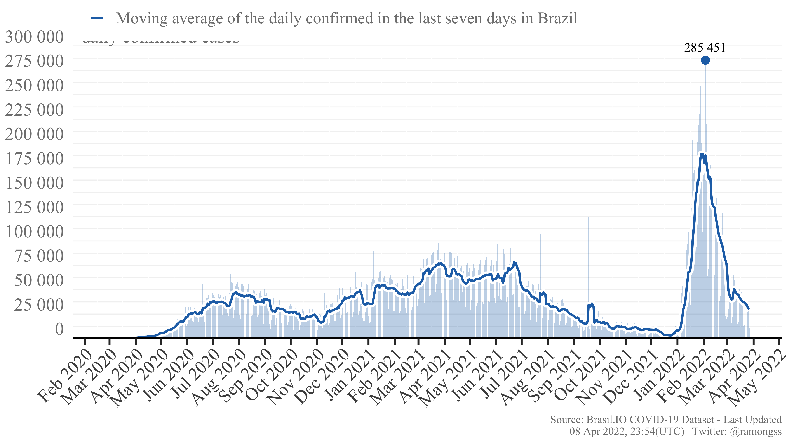

COVID-19 confirmed cases and deaths in Brazil
================

## Dataset

The dataset is provided by [Brasil.IO](https://brasil.io) which
retrieves the daily information about COVID-19 cases from all 27
Brazilian State Health Offices, assembles and makes them publicly
available. The data is daily updated and reported on the [Twitter
account](https://twitter.com/brasil_io).

Use the name of the table to the function `download_brasilio_table`, as
`caso`, `caso_full`, `obito_cartorio`:

``` r
download_brasilio_table <- function(dataset = "covid19", table_name){
  url <- sprintf(
    "https://data.brasil.io/dataset/%s/%s.csv.gz", dataset, table_name
  )
  tmp <- tempfile()
  download.file(url, tmp)
  response <- read.csv(gzfile(tmp), encoding = "UTF-8")
  unlink(tmp)
  return(response)
}
```

## COVID-19 Confirmed cases

Currently, Brazil has a total of **22,234,623** confirmed cases at **24
Dec, 2021**, with **3,537** new confirmed cases. The daily maximum
incidence was **124,878** confirmed cases at **18 Sep, 2021**. Here
follows the Figure showing the confirmed case incidence as the bars, and
the line as the moving average of the last 7 days.



## COVID-19 Deaths

Currently, Brazil has a total of **618,655** deaths at **24 Dec, 2021**,
with **158** new deaths. The daily maximum deaths incidence was
**4,148** deaths at **08 Apr, 2021**. Here follows the Figure showing
the deaths incidence as the bars, and the line as the moving average of
the last 7 days.


## Update

This page is daily updated automatically using Github Actions.

*Last update: 24 Dec 2021, 23:54 (UTC).*
